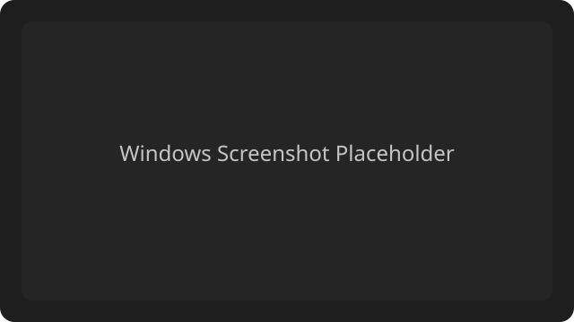

# Markdown 语法测试文档

> 用于测试渲染与编辑器行为的示例文档。
> 第二行引用。

## 标题

# H1 标题
## H2 标题
### H3 标题
#### H4 标题
##### H5 标题
###### H6 标题

---

## 段落与换行

这是第一段文字。  
这是一行内的强制换行（行末两个空格）。

这是第二段文字。

## 强调与格式

*斜体*、_斜体_、**粗体**、__粗体__、***粗斜体***、~~删除线~~

内联代码：`const value = 42;`

## 链接

内联链接：[OolongNoteDock](https://example.com)

引用式链接：[参考链接][ref-link]

自动链接：<https://example.com>

[ref-link]: https://example.com "示例站点"

## 图片




## 列表

无序列表：
- 项目 A
- 项目 B
  - 子项目 B1
  - 子项目 B2
    - 子项目 B2-a

有序列表：
1. 第一项
2. 第二项
3. 第三项
   1. 子项 3-1
   2. 子项 3-2

任务列表：
- [ ] 未完成任务
- [x] 已完成任务

## 引用

> 这是一个引用。
>
> - 引用中的列表
> - 第二项

## 代码块

行内代码：`print("hello")`

缩进代码块：

    function sum(a, b) {
      return a + b;
    }

围栏代码块：

```ts
interface Note {
  id: string;
  title: string;
}

const note: Note = { id: "1", title: "Demo" };
console.log(note);
```

```json
{
  "name": "oolong-note-dock",
  "version": "0.0.1"
}
```

## 表格

| 名称 | 类型 | 说明 |
| --- | --- | --- |
| id | string | 唯一标识 |
| title | string | 标题 |
| tags | string[] | 标签 |

对齐示例：

| 左对齐 | 居中 | 右对齐 |
| :--- | :---: | ---: |
| A | B | C |
| 1 | 2 | 3 |

## 分割线

---

***

___

## 转义字符

\\* 不是斜体  
\\_ 不是斜体  
\\` 不是代码  
\\# 不是标题  
\\- 不是列表

## HTML 内联

<details>
  <summary>点击展开</summary>
  <p>这里是 HTML 内容。</p>
</details>

<div style="padding:8px;border:1px dashed #999;">HTML 块级元素</div>

## 脚注（部分渲染器支持）

这里有一个脚注引用。[^footnote]

[^footnote]: 这是脚注内容。

## 引用块与代码混排

> 引用中包含代码：`inline code`
>
> ```
> code fence inside quote
> ```

## 结束

测试完毕。
